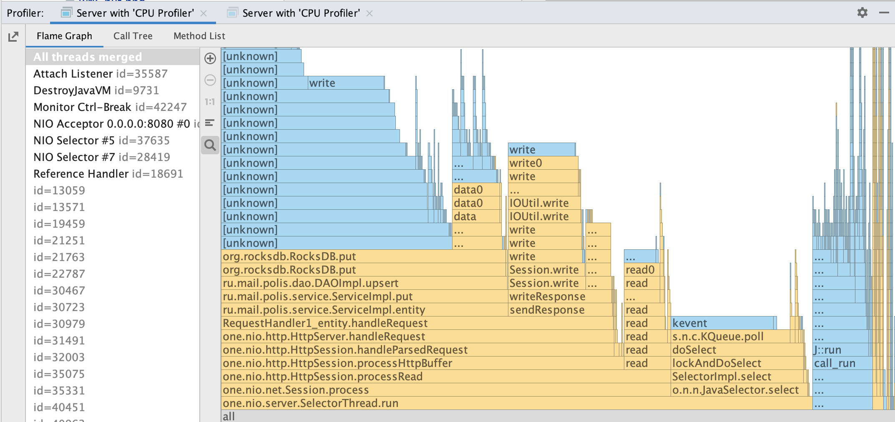
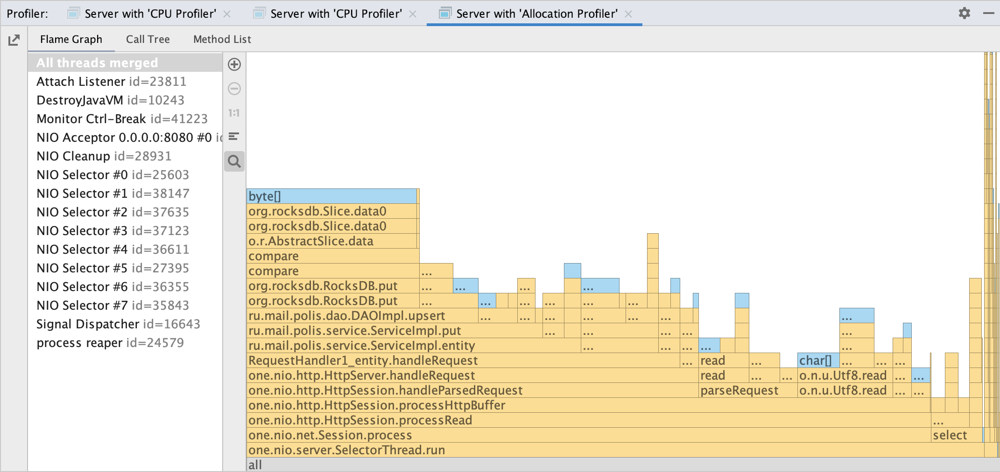
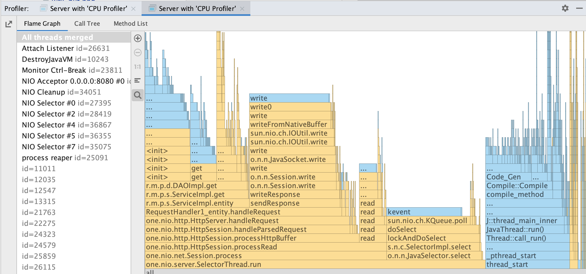

# Нагрузочное тестирование с помощью wrk

### Обстрел PUT-ами

Параметры запуска wrk
- 1 поток (worker) отправляющий запросы
- 1 открытое соединение
- 20 000 запросов в секунду
- длительность 30 секунд

### Результаты с async profiler-а (CPU)

Из диаграммы видно, что большинство запросов принадлежат NIO Selector-у, который обрабатывает наши запросы. Читая диграмму снизу вверх `one.nio.server.SelectorThread.run -> org.rocksdb.RocksDB.put`, видим, что процесс заканчивается помещением данных в RocksDB. А далее — `[unknown]`, так как профилировщик уже не может отследить происходящее.

### Результаты с async profiler-а (ALLOC)

Аналогичная ситуация с CPU — запросы NIO Selector-а занимают большую часть. Если прочитать диграмму снизу вверх `one.nio.server.SelectorThread.run -> byte[]`, видно, что процесс заканчивается выделением памяти для примитивов. 

Итак, можно сделать вывод, что 50-60% памяти занимает обработка запросов и где-то 30% - запись данных в DAO.

### Обстрел GET-ами

Параметры запуска wrk
- 1 поток (worker) отправляющий запросы
- 1 открытое соединение
- 20 000 запросов в секунду
- длительность 30 секунд

### Результаты с async profiler-а (CPU)

Своим внешним видом график для GET-запросов напоминает график для PUT (по крайней мере, левая его часть). А еще здесь профилировщик может отследить процесс глубже: за `ru.mail.polis.dao.DAOImpl.get` не следует `[unknown]`.

### Результаты с async profiler-а (ALLOC)

Здесь также большая часть — обработка запросов и меньшая часть — получение данных из DAO `ru.mail.polis.dao.DAOImpl.get`. Выше, как еще менее малочисленные, идут процессы форматирования и т д.

Исходя приведенных выше диаграмм, можно сказать, что примерно 60-70% памяти уходит на обработку запросов и 30-40% памяти — на получение данных из RocksDB.

