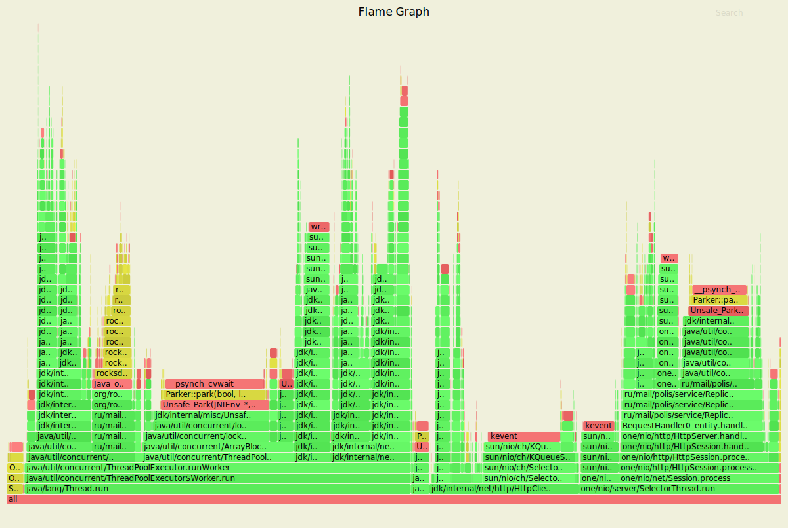
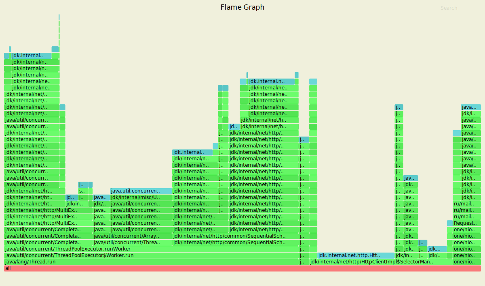

# Асинхронный клиент

На данном этапе внутреннее взаимодействие узлов было переписано на асинхронный `java.net.http.HttpClient`.

### Обстрел PUT-ами

Параметры запуска wrk
- 4 потока (worker'ы) отправляющие запросы
- 64 открытых соединения
- 10 000 запросов в секунду
- длительность 30 секунд

```text
Running 30s test @ http://127.0.0.1:8080/
  4 threads and 64 connections
  Thread calibration: mean lat.: 3.969ms, rate sampling interval: 12ms
  Thread calibration: mean lat.: 4.498ms, rate sampling interval: 12ms
  Thread calibration: mean lat.: 3.882ms, rate sampling interval: 12ms
  Thread calibration: mean lat.: 3.837ms, rate sampling interval: 12ms
  Thread Stats   Avg      Stdev     Max   +/- Stdev
    Latency    46.85ms   92.54ms 678.91ms   87.28%
    Req/Sec     2.55k   437.59     4.55k    69.78%
  Latency Distribution (HdrHistogram - Recorded Latency)
 50.000%    5.09ms
 75.000%   25.97ms
 90.000%  159.62ms
 99.000%  431.87ms
 99.900%  551.93ms
 99.990%  646.66ms
 99.999%  672.26ms
100.000%  679.42ms 
```

### Результаты с async profiler-а (CPU)


На графе значительно меньше сущностей из пакета `one.nio`, зато видна деятельность асинхронного HTTP-клиента. Также на Flame Graph появились примитивы синхронизации `java/util/concurrent`.

### Результаты с async profiler-а (ALLOC)


На Flame Graph внушительную часть занимает работа с CompletableFuture. Также видна локальная обработка запросов (handleLocal), работающая с `one.nio` и немного работы с сессией. По сравнению с предыдущим этапом наш код увидеть на графе нелегко. Зато хорошо видны потоки асинхронных HTTP клиентов.

### Результаты с async profiler-a (LOCK)


В отличие от прошлого этапа, Flame Graph LOCK'ов достаточно разнородный: здесь видны блокировки HTTP-клиента и работы сокетов. Также около 25% занимают локи CompletableFuture. CompletableFuture's являются видом межпотокового взаимодействия, поэтому внутри них используются примитивы синхронизации.

### Обстрел GET-ами

Параметры запуска wrk
- 4 потока (worker'ы) отправляющие запросы
- 64 открытых соединений
- 20 000 запросов в секунду
- длительность 30 секунд

```text
Running 30s test @ http://127.0.0.1:8080/
  4 threads and 64 connections
  Thread calibration: mean lat.: 2.375ms, rate sampling interval: 10ms
  Thread calibration: mean lat.: 2.343ms, rate sampling interval: 10ms
  Thread calibration: mean lat.: 2.391ms, rate sampling interval: 10ms
  Thread calibration: mean lat.: 3.001ms, rate sampling interval: 10ms
  Thread Stats   Avg      Stdev     Max   +/- Stdev
    Latency    70.43ms  138.98ms 733.70ms   85.80%
    Req/Sec     2.57k   569.48     5.22k    71.02%
  Latency Distribution (HdrHistogram - Recorded Latency)
 50.000%    4.39ms
 75.000%   41.57ms
 90.000%  296.45ms
 99.000%  577.02ms
 99.900%  665.09ms
 99.990%  717.31ms
 99.999%  732.16ms
100.000%  734.21ms
```

### Результаты с async profiler-а (CPU)


На графе очень сложно прочитать наш код, зато видно множество сущностей `java/util/concurrent`, работу с сокетами и следы деятельности асинхронного HTTP-клиента.

### Результаты с async profiler-а (ALLOC)


Внешний вид графа напоминает PUT ALLOC. Очень много сэмплов относятся к CompletableFutures.

### Результаты с async profiler-a (LOCK)



График LOCK'ов тоже очень неоднородный: много блокировок асинхронного HTTP-клиента и работы с CompletableFuture. Также видны блокировки ReentrantLock и AbstractQueueSynchronizer.

## Вывод

По результатам достаточно большого количества запусков очевидно, что время ответа и для GET, и для PUT увеличилось в 5-7 раз. Несмотря на то, что у нас теперь асинхронный клиент, и запросы долго не стоят в очереди, тратится довольно много ресурсов на вычисление значений CompletableFuture и, судя по графам, появилось много блокировок.