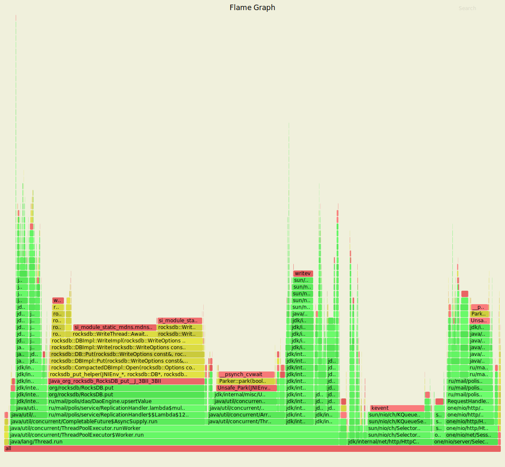
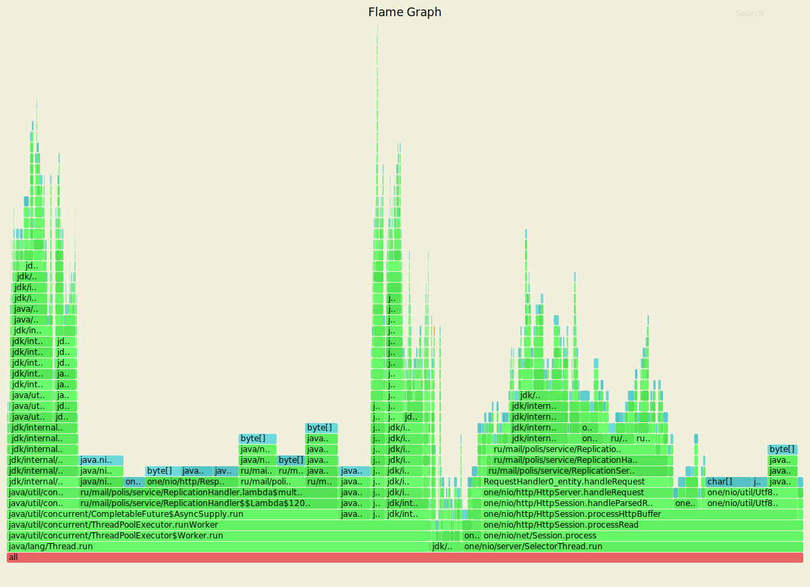
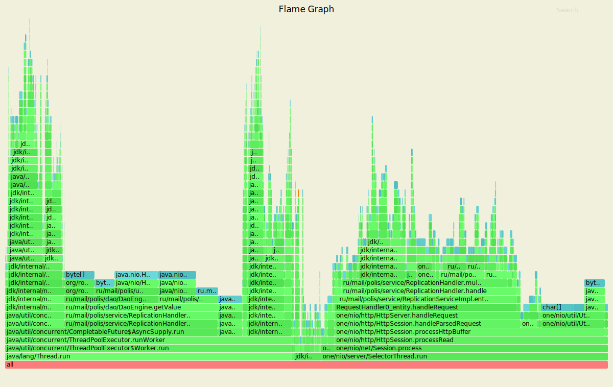

# Асинхронный клиент

На данном этапе внутреннее взаимодействие узлов было переписано на асинхронный `java.net.http.HttpClient`.

### Обстрел PUT-ами

Параметры запуска wrk
- 4 потока (worker'ы) отправляющие запросы
- 64 открытых соединения
- 3 000 запросов в секунду
- длительность 30 секунд

```text
Polinas-MacBook-Pro:wrk2 polina$ ./wrk -t4 -c64 -d30s -R3000 --latency -s ./scripts/put.lua http://127.0.0.1:8080/
Running 30s test @ http://127.0.0.1:8080/
  4 threads and 64 connections
  Thread calibration: mean lat.: 1.571ms, rate sampling interval: 10ms
  Thread calibration: mean lat.: 1.518ms, rate sampling interval: 10ms
  Thread calibration: mean lat.: 1.530ms, rate sampling interval: 10ms
  Thread calibration: mean lat.: 4.064ms, rate sampling interval: 11ms
  Thread Stats   Avg      Stdev     Max   +/- Stdev
    Latency     1.81ms    1.04ms  19.41ms   80.08%
    Req/Sec   792.54    328.43     1.90k    79.42%
  Latency Distribution (HdrHistogram - Recorded Latency)
 50.000%    1.60ms
 75.000%    2.19ms
 90.000%    3.01ms
 99.000%    5.25ms
 99.900%    9.94ms
 99.990%   16.93ms
 99.999%   19.30ms
100.000%   19.42ms
```

### Результаты с async profiler-а (CPU)


На графе значительно меньше сущностей из пакета `one.nio`, зато видна деятельность асинхронного HTTP-клиента. Также на Flame Graph появились примитивы синхронизации `java/util/concurrent`.

### Результаты с async profiler-а (ALLOC)


На Flame Graph внушительную часть занимает работа с CompletableFuture. Также видна локальная обработка запросов (handleLocal), работающая с `one.nio` и немного работы с сессией. По сравнению с предыдущим этапом наш код увидеть на графе нелегко. Зато хорошо видны потоки асинхронных HTTP клиентов.

### Результаты с async profiler-a (LOCK)


В отличие от прошлого этапа, Flame Graph LOCK'ов достаточно разнородный: здесь видны блокировки HTTP-клиента и работы сокетов. Также около 25% занимают локи CompletableFuture. CompletableFuture's являются видом межпотокового взаимодействия, поэтому внутри них используются примитивы синхронизации.

### Обстрел GET-ами

Параметры запуска wrk
- 4 потока (worker'ы) отправляющие запросы
- 64 открытых соединений
- 3 000 запросов в секунду
- длительность 30 секунд

```text
Running 30s test @ http://127.0.0.1:8080/
  4 threads and 64 connections
  Thread calibration: mean lat.: 1.477ms, rate sampling interval: 10ms
  Thread calibration: mean lat.: 1.502ms, rate sampling interval: 10ms
  Thread calibration: mean lat.: 1.463ms, rate sampling interval: 10ms
  Thread calibration: mean lat.: 1.506ms, rate sampling interval: 10ms
  Thread Stats   Avg      Stdev     Max   +/- Stdev
    Latency     1.43ms  773.13us  17.15ms   83.53%
    Req/Sec   789.88    111.24     1.78k    80.89%
  Latency Distribution (HdrHistogram - Recorded Latency)
 50.000%    1.35ms
 75.000%    1.73ms
 90.000%    2.13ms
 99.000%    3.55ms
 99.900%   11.04ms
 99.990%   14.84ms
 99.999%   16.50ms
100.000%   17.17ms
```

### Результаты с async profiler-а (CPU)


На графе очень сложно прочитать наш код, зато видно множество сущностей `java/util/concurrent`, работу с сокетами и следы деятельности асинхронного HTTP-клиента.

### Результаты с async profiler-а (ALLOC)


Внешний вид графа напоминает PUT ALLOC. Очень много сэмплов относятся к CompletableFutures.

### Результаты с async profiler-a (LOCK)


График LOCK'ов тоже очень неоднородный: много блокировок асинхронного HTTP-клиента и работы с CompletableFuture. Также видны блокировки ReentrantLock и AbstractQueueSynchronizer.

## Вывод

На данном этапе обстрел GET-ами и PUT-ами проводился меньшим количеством запросов в секунду (3 000 вместо 10 000). При обстреле запросами той же интенсивности наблюдалась сильная деградация быстродействия (в среднем в 5-7 раз по результатам 10 запусков). С меньшей нагрузкой асинхронный клиент справляется довольно бодро. 

Несмотря на то, что у нас теперь асинхронный клиент, и запросы долго не стоят в очереди, тратится довольно много ресурсов на вычисление значений CompletableFuture и, судя по графам, появилось много блокировок.