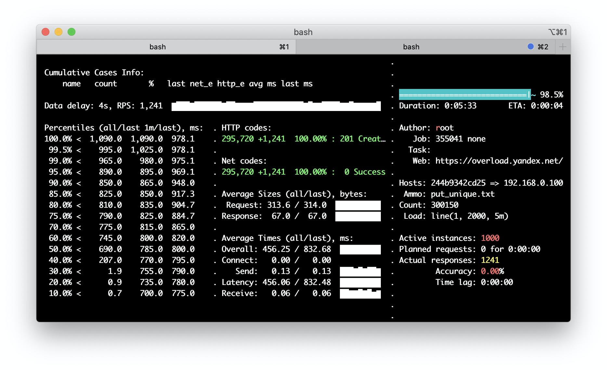
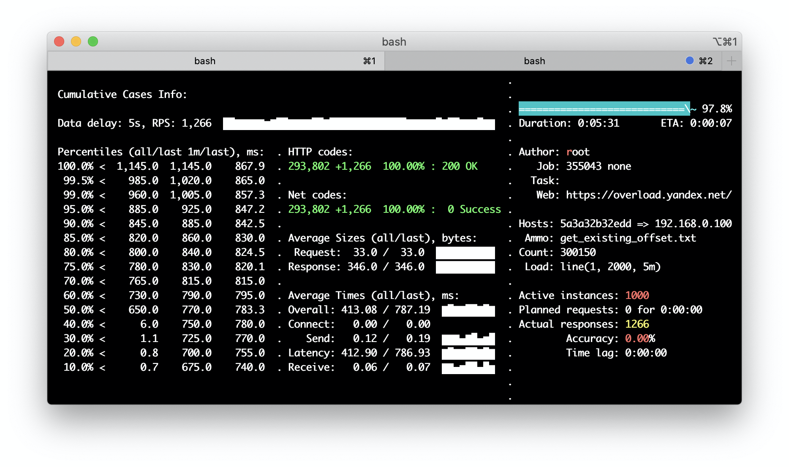
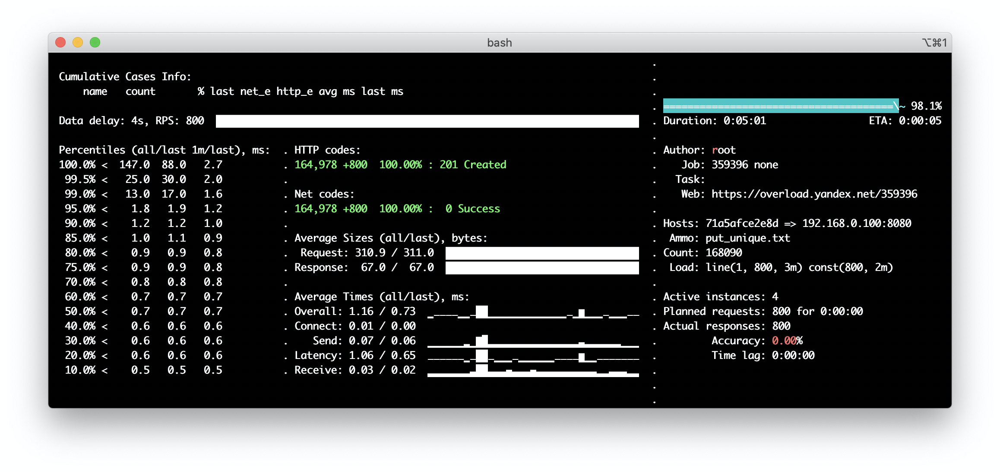
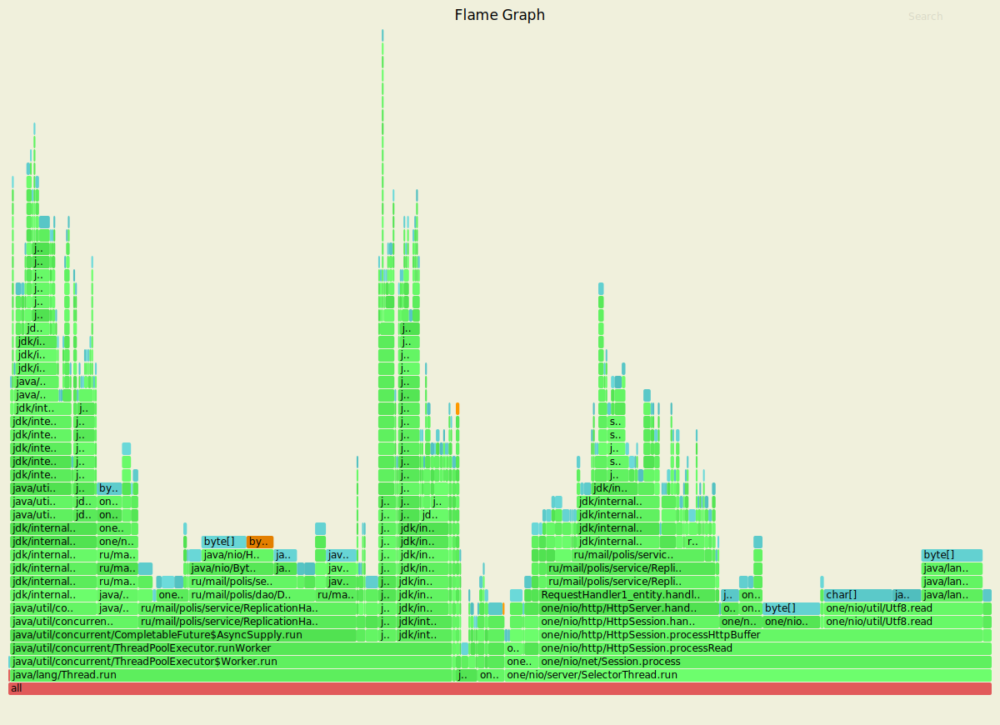
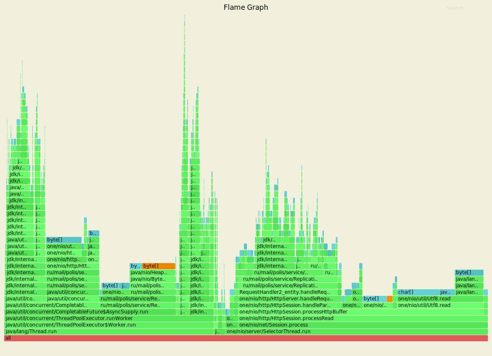
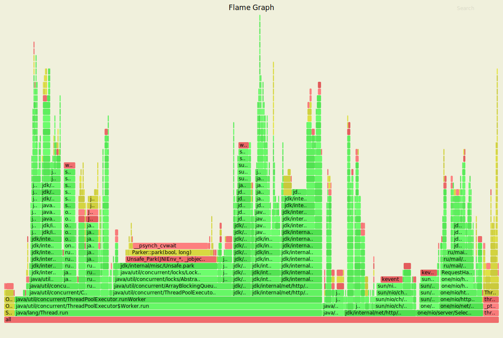
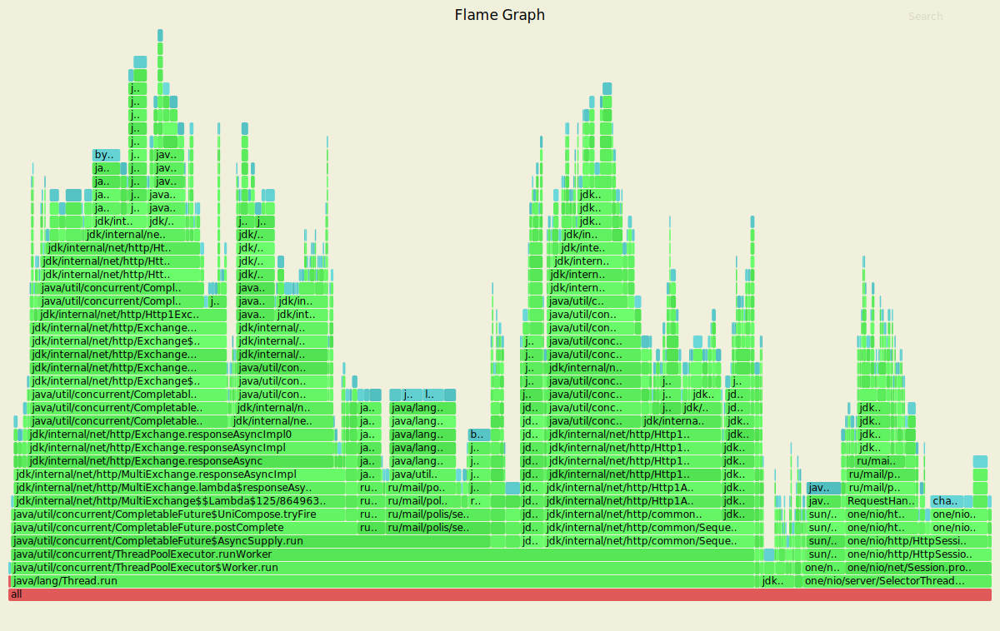
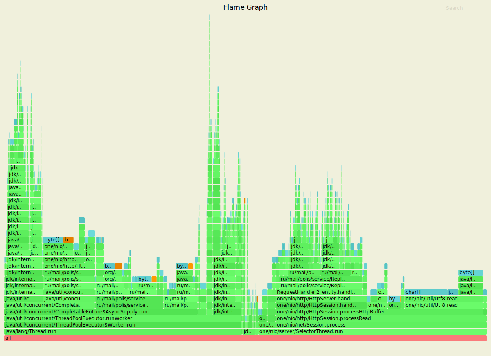

# Нагрузочное тестирование при помощи Яндекс.Танк

Для проведения испытаний был написан [простой генератор патронов](/src/main/java/ru/mail/polis/AmmoGenerator.java), поддерживающий генерацию патронов в пяти режимах.
1. Лента с PUT-ами с уникальными ключами
2. Лента с PUT-ами с частичной перезаписью ключей (вероятность 10%)
3. Лента с GET-ами существующих ключей с равномерным распределением (стреляем по наполненной БД)
4. То же самое, но со смещением распределения GET-ов к недавно добавленным ключам (частый случай на практике)
5. Наконец, лента со смешанной нагрузкой с 50% PUT-ы новых ключей и 50% GETы существующих ключей (равномерное распределение)

Яндекс.Танк был собран через докер согласно официальной документации.
```text
docker run -v "$(pwd):/var/loadtest" -v "$HOME/.ssh:/root/.ssh" -it direvius/yandex-tank
```

Для стрельб использовался следующий конфиг:
```text
phantom:
  address: 192.168.0.100:8080
  ammofile: generated_files/get_existing_gauss.txt
  load_profile:
    load_type: rps
    schedule: line(1, 1000, 2m) const(1000, 3m)
console:
  enabled: true
telegraf:
  enabled: false
overload:
  enabled: true
  token_file: token.txt
```

Далее было проведено довольно большое количество испытаний для выяснения точки разладки. Было выяснено, что в среднем сервис хорошо держит нагрузку 2000 запросов в секунду. Выше 3000 rps воркеры задействуются на максимум (1000 без выставленного ограничения в конфиге), а время ожидания ответа от сервиса сильно растягивается (вместо заявленных 5 минут стрельбы получаем 15-18 мин).

## Выяснение оптимальной нагрузки

1. [Лента с PUT-ами с уникальными ключами](https://overload.yandex.net/355041#tab=test_data&tags=&plot_groups=main&machines=&metrics=&slider_start=1606174457&slider_end=1606174789)


2. [Лента с PUT-ами с частичной перезаписью ключей (вероятность 10%)](https://overload.yandex.net/355042#tab=test_data&tags=&plot_groups=main&machines=&metrics=&slider_start=1606174941&slider_end=1606175276)


3. [Лента с GET-ами существующих ключей с равномерным распределением (стреляем по наполненной БД)](https://overload.yandex.net/355032#tab=test_data&tags=&plot_groups=main&machines=&metrics=&slider_start=1606170625&slider_end=1606170951)


4. [То же самое, но со смещением распределения GET-ов к недавно добавленным ключам (частый случай на практике)](https://overload.yandex.net/355043#tab=test_data&tags=&plot_groups=main&machines=&metrics=&slider_start=1606175385&slider_end=1606175715)


5. [Наконец, лента со смешанной нагрузкой с 50% PUT-ы новых ключей и 50% GETы существующих ключей (равномерное распределение)](https://overload.yandex.net/355040#tab=test_data&tags=&plot_groups=main&machines=&metrics=&slider_start=1606173662&slider_end=1606174020)


## Обстрел line + const

Если на этапе проведения тестов 2000 запросов в секунду казалось адекватным значением, во время перехода к боевым стрельбам опытным путем было решено нагрузку уменьшить до 1500 запросов в секунду, а где-то и до 1200 или 1000. При большей нагрузке в ответах появлялись 504 Error Code'ы и небольшой процент 71 Protocol Error. После уменьшения нагрузки имеем 99.9-100% успешно обработанных запросов (Response Code'ы 200, 201, 404).

1. [Лента с PUT-ами с уникальными ключами](https://overload.yandex.net/359396#tab=test_data&tags=&plot_groups=main&machines=&metrics=&slider_start=1606927469&slider_end=1606927768&compress_ratio=1)


2. [Лента с PUT-ами с частичной перезаписью ключей (вероятность 10%)](https://overload.yandex.net/358947#tab=test_data&tags=&plot_groups=main&machines=&metrics=&slider_start=1606858021&slider_end=1606858321)


3. [Лента с GET-ами существующих ключей с равномерным распределением (стреляем по наполненной БД)](https://overload.yandex.net/358949#tab=test_data&tags=&plot_groups=main&machines=&metrics=&slider_start=1606858499&slider_end=1606858799)


4. [То же самое, но со смещением распределения GET-ов к недавно добавленным ключам (частый случай на практике)](https://overload.yandex.net/358951#tab=test_data&tags=&plot_groups=main&machines=&metrics=&slider_start=1606858893&slider_end=1606859193)


5. [Наконец, лента со смешанной нагрузкой с 50% PUT-ы новых ключей и 50% GETы существующих ключей (равномерное распределение)](https://overload.yandex.net/358957#tab=test_data&tags=&plot_groups=main&machines=&metrics=&slider_start=1606859279&slider_end=1606859579)


## Анализ времени ответа

1. Лента с PUT-ами с уникальными ключами


2. Лента с PUT-ами с частичной перезаписью ключей (вероятность 10%)


3. Лента с GET-ами существующих ключей с равномерным распределением (стреляем по наполненной БД)


4. То же самое, но со смещением распределения GET-ов к недавно добавленным ключам (частый случай на практике)


5. Наконец, лента со смешанной нагрузкой с 50% PUT-ы новых ключей и 50% GETы существующих ключей (равномерное распределение)


В идеальном случае график distribution должен напоминать гиперболу. Некоторые кейсы к нему максимально близки, например, номер два. Однако в большинстве случаев где-то на 2/3 графика мы видим еще один холмик (запросы обрабатываются не сразу). Вероятно, это явление связано с очередью на flush или сборкой мусора.

## Профилирование при помощи async-profiler

### 1. Лента с PUT-ами с уникальными ключами

#### CPU


#### ALLOC


### 2. Лента с PUT-ами с частичной перезаписью ключей (вероятность 10%)

#### CPU


#### ALLOC


### 3. Лента с GET-ами существующих ключей с равномерным распределением (стреляем по наполненной БД)

#### CPU


#### ALLOC


### 4. То же самое, но со смещением распределения GET-ов к недавно добавленным ключам (частый случай на практике)

#### CPU


#### ALLOC


### 5. Наконец, лента со смешанной нагрузкой с 50% PUT-ы новых ключей и 50% GETы существующих ключей (равномерное распределение)

#### CPU


#### ALLOC


### Вывод по профилированию

Графики с первого по четвертый шаг очень напоминают результаты профилирования полученные на шестом этапе — те же операции чтения / записи, пересылки запросов и работы с фьючами. На пятом шаге присутствуют операции характерные и для GET, и для PUT. Чего-то сильно тормозящего работу (например, логирования) на графиках не выявлено.

## Общий вывод

На данном этапе было проведено нагрузочное тестирование при помощи Яндекс.Танк. В результате испытаний было выяснено, что сервис «держит» обстрел нагрузкой 2000 запросов в секунду. Для обстрела line + const было взято меньшее значение (1500, 1200 или 1000 rps в зависимости от шага). В отличие от wrk в Яндекс.Танк существует больше способов мониторить, как сервис держит нагрузку (например, отчасти можно судить по числу задействованных воркеров). Также в веб-интерфейсе предоставляется подробная статистика по каждой из стрельб.