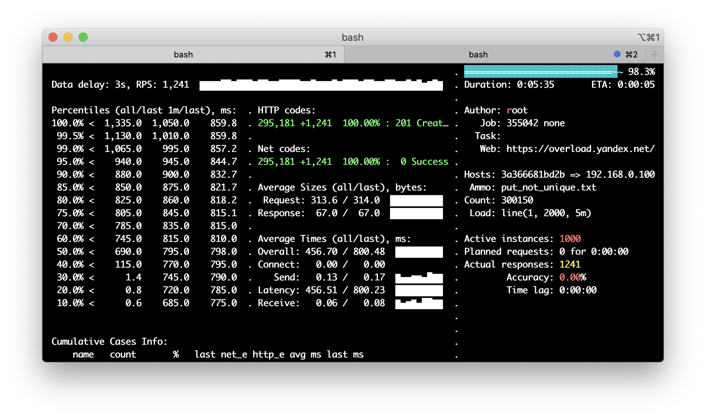
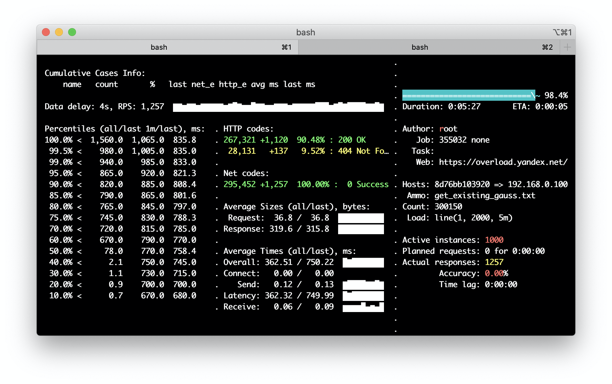
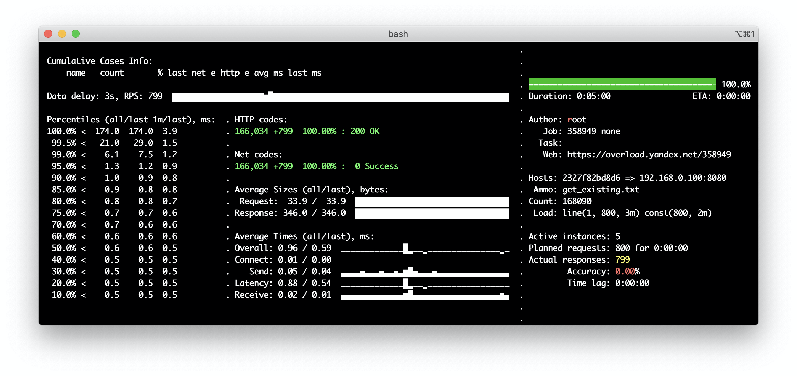
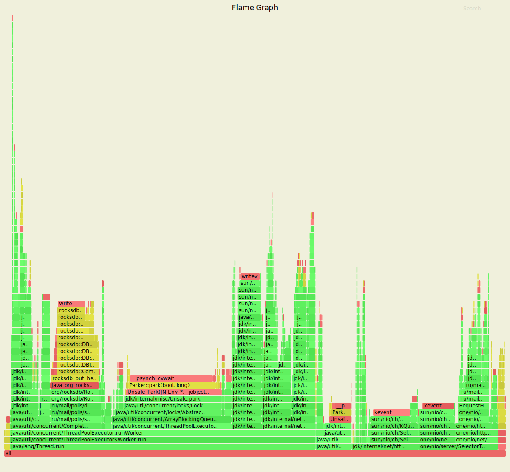
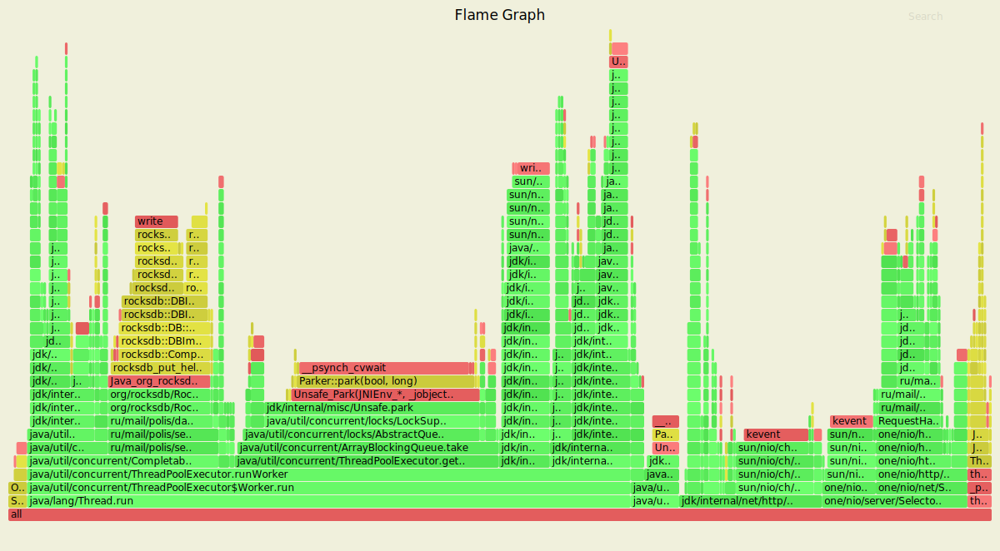
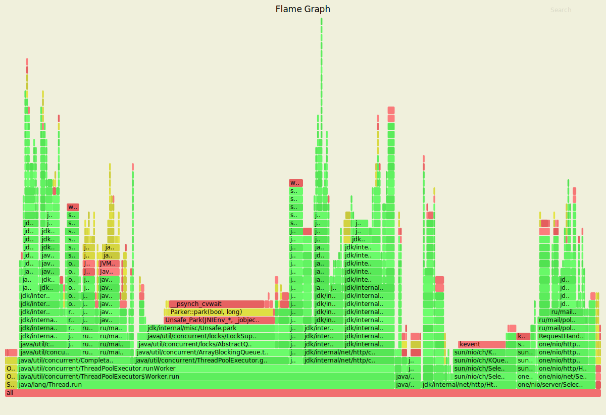
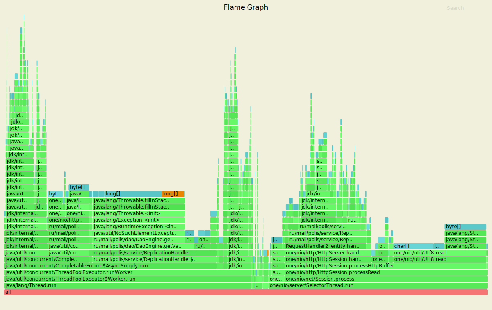
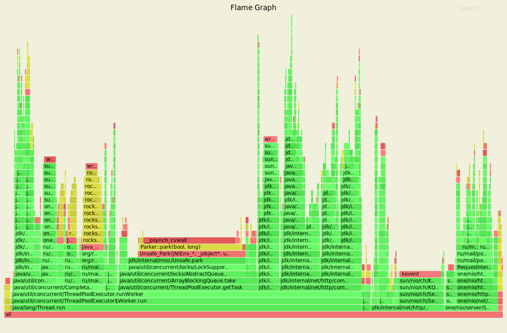
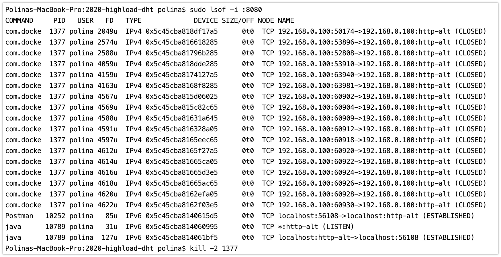

# Нагрузочное тестирование при помощи Яндекс.Танк

Для проведения испытаний был написан [простой генератор патронов](/src/main/java/ru/mail/polis/AmmoGenerator.java), поддерживающий генерацию патронов в пяти режимах.
1. Лента с PUT-ами с уникальными ключами
2. Лента с PUT-ами с частичной перезаписью ключей (вероятность 10%)
3. Лента с GET-ами существующих ключей с равномерным распределением (стреляем по наполненной БД)
4. То же самое, но со смещением распределения GET-ов к недавно добавленным ключам (частый случай на практике)
5. Наконец, лента со смешанной нагрузкой с 50% PUT-ы новых ключей и 50% GETы существующих ключей (равномерное распределение)

Яндекс.Танк был собран через докер согласно официальной документации.
```text
docker run -v "$(pwd):/var/loadtest" -v "$HOME/.ssh:/root/.ssh" -it direvius/yandex-tank
```

Для стрельб использовался следующий конфиг:
```text
phantom:
  address: 192.168.0.100:8080
  ammofile: generated_files/get_existing_gauss.txt
  load_profile:
    load_type: rps
    schedule: line(1, 1000, 2m) const(1000, 3m)
console:
  enabled: true
telegraf:
  enabled: false
overload:
  enabled: true
  token_file: token.txt
```

Далее было проведено довольно большое количество испытаний для выяснения точки разладки. Было выяснено, что в среднем сервис хорошо держит нагрузку 2000 запросов в секунду. Выше 3000 rps воркеры задействуются на максимум (1000 без выставленного ограничения в конфиге), а время ожидания ответа от сервиса сильно растягивается (вместо заявленных 5 минут стрельбы получаем 15-18 мин).

## Выяснение оптимальной нагрузки

1. [Лента с PUT-ами с уникальными ключами](https://overload.yandex.net/355041#tab=test_data&tags=&plot_groups=main&machines=&metrics=&slider_start=1606174457&slider_end=1606174789)


2. [Лента с PUT-ами с частичной перезаписью ключей (вероятность 10%)](https://overload.yandex.net/355042#tab=test_data&tags=&plot_groups=main&machines=&metrics=&slider_start=1606174941&slider_end=1606175276)


3. [Лента с GET-ами существующих ключей с равномерным распределением (стреляем по наполненной БД)](https://overload.yandex.net/355032#tab=test_data&tags=&plot_groups=main&machines=&metrics=&slider_start=1606170625&slider_end=1606170951)


4. [То же самое, но со смещением распределения GET-ов к недавно добавленным ключам (частый случай на практике)](https://overload.yandex.net/355043#tab=test_data&tags=&plot_groups=main&machines=&metrics=&slider_start=1606175385&slider_end=1606175715)


5. [Наконец, лента со смешанной нагрузкой с 50% PUT-ы новых ключей и 50% GETы существующих ключей (равномерное распределение)](https://overload.yandex.net/355040#tab=test_data&tags=&plot_groups=main&machines=&metrics=&slider_start=1606173662&slider_end=1606174020)


## Обстрел line + const

Если на этапе проведения тестов 2000 запросов в секунду казалось адекватным значением, во время перехода к боевым стрельбам опытным путем было решено нагрузку уменьшить до 800 запросов в секунду. Нужно отметить, что стрельбы проводились на 1500, 1200 и на 1000 rps, в разные дни и с разным «прогревом» сервиса. В конце отчета представлен разбор допущенных ошибок. Пока имеем rps = 800.

1. [Лента с PUT-ами с уникальными ключами](https://overload.yandex.net/359396#tab=test_data&tags=&plot_groups=main&machines=&metrics=&slider_start=1606927469&slider_end=1606927768&compress_ratio=1)


2. [Лента с PUT-ами с частичной перезаписью ключей (вероятность 10%)](https://overload.yandex.net/358947#tab=test_data&tags=&plot_groups=main&machines=&metrics=&slider_start=1606858021&slider_end=1606858321)


3. [Лента с GET-ами существующих ключей с равномерным распределением (стреляем по наполненной БД)](https://overload.yandex.net/358949#tab=test_data&tags=&plot_groups=main&machines=&metrics=&slider_start=1606858499&slider_end=1606858799)


4. [То же самое, но со смещением распределения GET-ов к недавно добавленным ключам (частый случай на практике)](https://overload.yandex.net/358951#tab=test_data&tags=&plot_groups=main&machines=&metrics=&slider_start=1606858893&slider_end=1606859193)


5. [Наконец, лента со смешанной нагрузкой с 50% PUT-ы новых ключей и 50% GETы существующих ключей (равномерное распределение)](https://overload.yandex.net/358957#tab=test_data&tags=&plot_groups=main&machines=&metrics=&slider_start=1606859279&slider_end=1606859579)


## Анализ времени ответа

1. Лента с PUT-ами с уникальными ключами


2. Лента с PUT-ами с частичной перезаписью ключей (вероятность 10%)


3. Лента с GET-ами существующих ключей с равномерным распределением (стреляем по наполненной БД)


4. То же самое, но со смещением распределения GET-ов к недавно добавленным ключам (частый случай на практике)


5. Наконец, лента со смешанной нагрузкой с 50% PUT-ы новых ключей и 50% GETы существующих ключей (равномерное распределение)


В результате имеем почти идеальную гиперболу, не считая самое первое значение на графике (второе значение максимально, и дальше идет по убыванию). Вероятно, это связано с тем, что сбор ответов от нод занимает немного времени, а если идет обращение к локальному хранилищу, то все происходит чуть быстрее. Но таких ответов естественно не большинство. В целом можно сказать, что подавляющее большинство запросов обрабатывается быстро, значит, нагрузка для сервиса была посильной.

## Сравнительный анализ персентилей

1. Лента с PUT-ами с уникальными ключами: 95% — 1 ms, 99% — 17ms
2. Лента с PUT-ами с частичной перезаписью ключей (вероятность 10%): 95% — 1 ms, 99% — 16 ms
3. Лента с GET-ами существующих ключей с равномерным распределением (стреляем по наполненной БД): 95% — 1 ms, 99% — 5ms
4. То же самое, но со смещением распределения GET-ов к недавно добавленным ключам (частый случай на практике): 95% — 1 ms, 99% — 14 ms
5. Наконец, лента со смешанной нагрузкой с 50% PUT-ы новых ключей и 50% GETы существующих ключей (равномерное распределение): 95% — 1 ms, 99% — 5 ms (и PUT, и GET)

Видно, что при любом режиме стрельбы 99% запросов обрабатываются за 1 ms. Также можно отметить, что 99% запросов для первого и второго режима обрабатываются ~в 3 раза медленнее, чем для третьего. Можно предположить, что PUT затратнее, чем GET из-за блокировок ресурсов при записи. Однако возникает вопрос, почему тогда GET в четвертом режиме отрабатывает сравнительно долго. Несколько раз перезапустив стрельбы, значительного ускорения не получила. Почитав файл с патронами, поняла, что часто шли обращения по одним и тем же ключам. Вероятно, ответственные за эти ключи ноды сервера были сильнее загружены работой, чем в режиме три, поэтому мы имеем обработку 99% запросов за 14 ms. Интересно, что в режиме пять при равномерном распределении мы имеем одинаковую скорость работы и для GET, и для PUT. Вполне возможно, здесь сыграла роль равномерность распределения ключей и то что PUT запросов по сравнению с первым и вторым режимом было в два раза меньше. 


## Профилирование при помощи async-profiler

### 1. Лента с PUT-ами с уникальными ключами

#### CPU


#### ALLOC


### 2. Лента с PUT-ами с частичной перезаписью ключей (вероятность 10%)

#### CPU


#### ALLOC


### 3. Лента с GET-ами существующих ключей с равномерным распределением (стреляем по наполненной БД)

#### CPU


#### ALLOC


### 4. То же самое, но со смещением распределения GET-ов к недавно добавленным ключам (частый случай на практике)

#### CPU


#### ALLOC


### 5. Наконец, лента со смешанной нагрузкой с 50% PUT-ы новых ключей и 50% GETы существующих ключей (равномерное распределение)

#### CPU


#### ALLOC


### Вывод по профилированию

Графики с первого по четвертый шаг очень напоминают результаты профилирования полученные на шестом этапе — те же операции чтения / записи, пересылки запросов и работы с фьючами. На пятом шаге присутствуют операции характерные и для GET, и для PUT. Чего-то сильно тормозящего работу (например, логирования) на графиках не выявлено.

## Разбор допущенных ошибок 

В ревью были отмечена некорректная реализация режима четыре (GET по недавно добавленным ключам). После ее исправления (теперь используется Гаусс вместо кусочной функции) ушли 404 ошибки и провал на графике в нагрузке. Что касается сетевых ошибок, выяснено, что 71 Protocol Error были вызваны [слишком большим](https://ru.stackoverflow.com/questions/469172/%D0%95%D1%81%D1%82%D1%8C-%D0%BB%D0%B8-%D0%BA%D0%B0%D0%BA%D0%B8%D0%B5-%D0%BB%D0%B8%D0%B1%D0%BE-%D0%BE%D0%B3%D1%80%D0%B0%D0%BD%D0%B8%D1%87%D0%B5%D0%BD%D0%B8%D1%8F-%D0%BF%D1%80%D0%B8-%D0%BF%D0%BE%D1%81%D1%82%D1%80%D0%BE%D0%B5%D0%BD%D0%B8%D0%B8-http-%D0%B7%D0%B0%D0%BF%D1%80%D0%BE%D1%81%D0%BE%D0%B2-%D0%B2-yandex-tank-%D0%B5) файлом патронов, а 110 Connection Timeout — проблемами с докером на локальной машине. После чистки лишних контейнеров и процессов, стрельбы стали стабильными.


Даже после всех исправлений, небольшие скачки на графиках Quantiles и Threads все же остались. Однако, если сопоставить их с представленными ниже графиками HTTP Codes и Error Codes, видно, что во время скачка нагрузки сервис отдает чуть меньше ожидаемых (200, 201) ответов, а в следующий момент — чуть больше. Особенно хорошо это видно на графиках третьего режима. Из этого следует, что все под контролем, и сервис справляется. Сами по себе скачки могут быть вызваны несколькими причинами: например, сборка мусора, очередь на flush и т д.

## Общий вывод

На данном этапе было проведено нагрузочное тестирование при помощи Яндекс.Танк. В результате испытаний было выяснено, что сервис «держит» обстрел нагрузкой 2000 запросов в секунду. Для обстрела line + const было взято меньшее значение (1500, 1200 или 1000 rps в зависимости от шага). В отличие от wrk в Яндекс.Танк существует больше способов мониторить, как сервис держит нагрузку (например, отчасти можно судить по числу задействованных воркеров). Также в веб-интерфейсе предоставляется подробная статистика по каждой из стрельб.